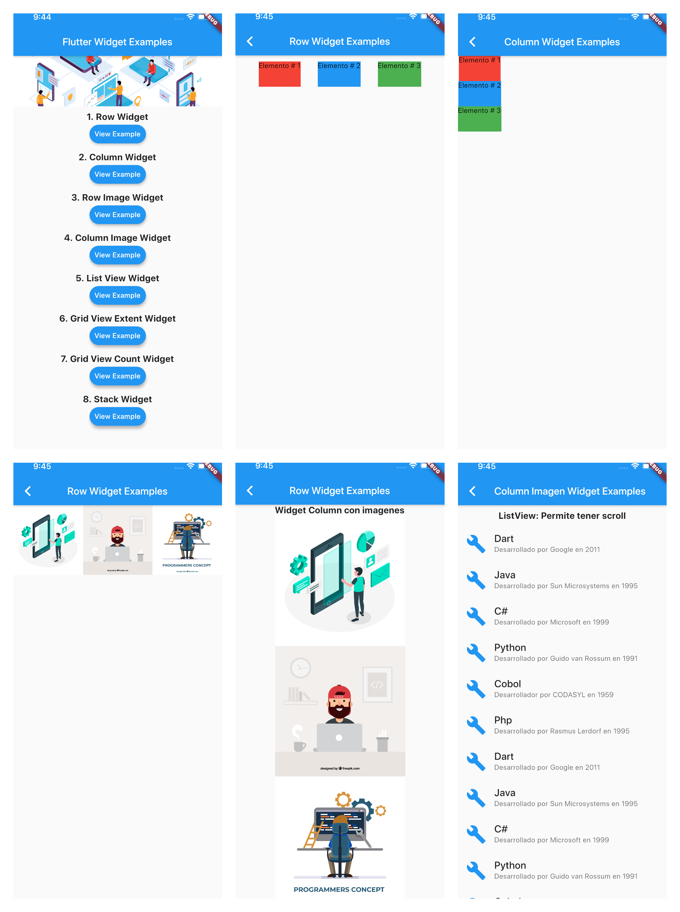
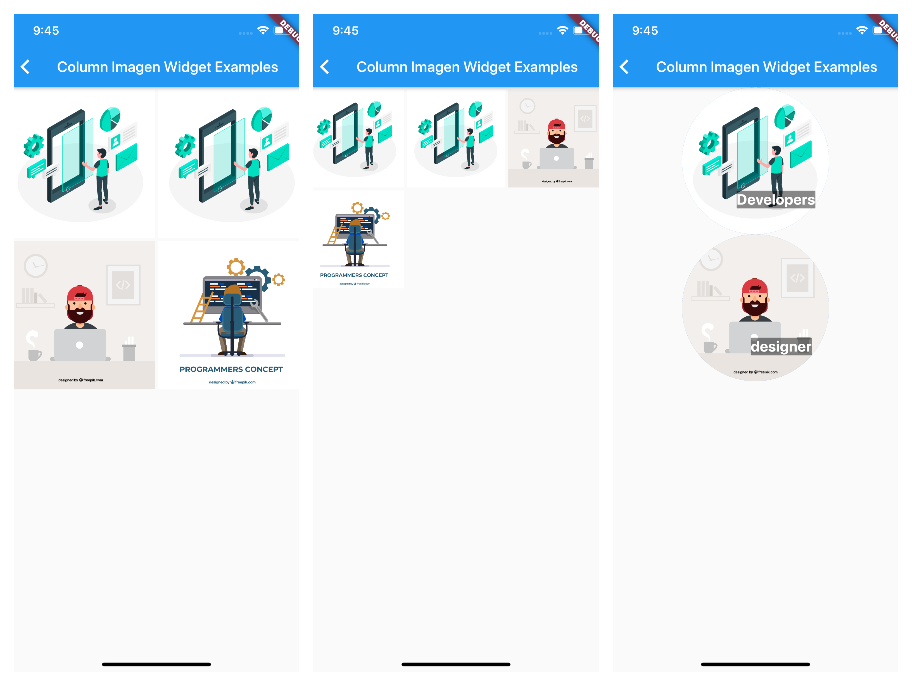

# FlutterWidgets

App multiplataforma donde se realiza la implementación de widgets tipo layout proporcionados por Flutter.

## Fuentes oficiales

https://flutter-es.io/docs/get-started/install

https://flutter.dev/

### Generar iconos para Android y iOS

Agregar en el archivo pubspec.yaml las siguientes lineas:

```
dev_dependencies:
  flutter_launcher_icons: "^0.7.3"

flutter_icons:
  android: true
  ios: true
  image_path: "assets/images/icono_app.png"
  ```

### Screenshot
<br>

</br>
<br>

</br>

  https://github.com/jsierra93
